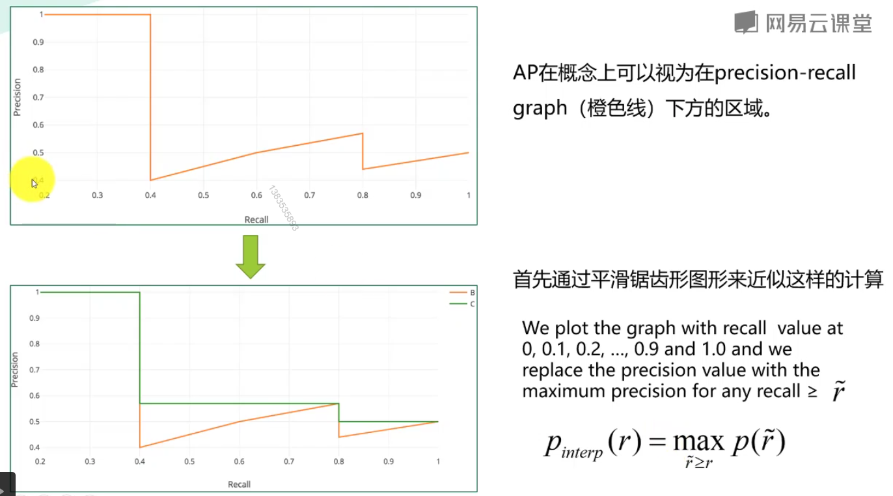

#
YOLOv3实战：训练自己的数据集
## 章节一：课程介绍
###课时1 课程介绍
>1 、目标检测：确定位置和分类

>2、YOLOv3以推理速度快著称 50ms以内 可达到实时目标检测

>3、Darknet
	
	darknet一个轻型的开源深度学习框架
	功能;CNN 底层实现；YOLO目标检测；RNN；图像实力分割等
	特点：
1. 由C语言实现
2. 没有依赖项（摄像头和视频处理需要Opencv）
3. 容易安装
4. 移植性好
5. 支持CPU与GPU（CUDA）两种计算方式

>4、项目流程
>RTFGV54
1. 安装darknet
2. 给自己的数据集打标签
3. 整理自己的数据集
4. 修改配置文件按
5. 训练自己的数据集
6. 测试训练出的网络模型
7. 性能统计
8. 先验框据类与修改

>5、图片标注工具LabelImg

## 章节二 目标检测基础知识
###课时2、目标检测任务
>1、目标检测Object Detection
>
>帮助人们知道图片上有什么目标
>位置、识别 类别标签（Category label）

>2、定位和检测：

	定位是找到检测图像中带有一个给定标签的单个目标
	检查测是找到图像中带有给定标签的所有目标

###课时3 目标检测-常用数据集

	PASCAL VOC
	ImageNet
	COCO

>1、PASCAL VOC　challenge

###课时4 目标检测-性能指标
 >1、性能指标
 
		Precision，Recall，F1 score
		IoU（Intersection over Union）
		P-R curve （Precision-Recall curve）
		AP（Average Precision）
		mAP（mean Average Precision）
		FPS（Frames Per Second）

 

 

 

 

 

 

 

 

 

 

###课时5 目标检测-网络模型演进
>1、基于深度学习实现目标检测

 
 
 
 
 
 