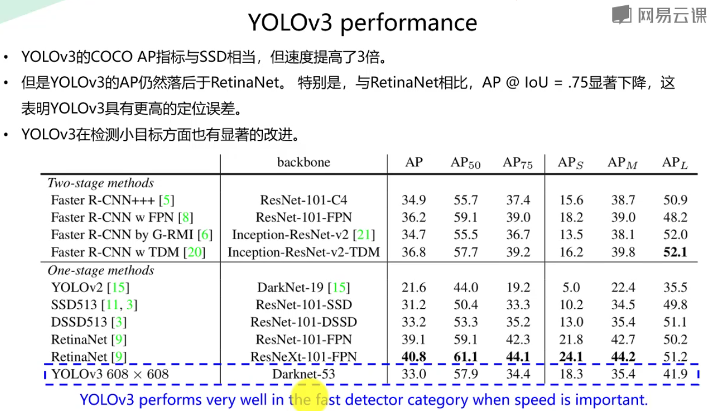

#
YOLOv3实战：训练自己的数据集
## 章节一：课程介绍
###课时1 课程介绍
>1 、目标检测：确定位置和分类

>2、YOLOv3以推理速度快著称 50ms以内 可达到实时目标检测

>3、Darknet
	
	darknet一个轻型的开源深度学习框架
	功能;CNN 底层实现；YOLO目标检测；RNN；图像实力分割等
	特点：
1. 由C语言实现
2. 没有依赖项（摄像头和视频处理需要Opencv）
3. 容易安装
4. 移植性好
5. 支持CPU与GPU（CUDA）两种计算方式

>4、项目流程
>RTFGV54
1. 安装darknet
2. 给自己的数据集打标签
3. 整理自己的数据集
4. 修改配置文件按
5. 训练自己的数据集
6. 测试训练出的网络模型
7. 性能统计
8. 先验框据类与修改

>5、图片标注工具LabelImg

## 章节二 目标检测基础知识
###课时2、目标检测任务
>1、目标检测Object Detection
>
>帮助人们知道图片上有什么目标
>位置、识别 类别标签（Category label）

>2、定位和检测：

	定位是找到检测图像中带有一个给定标签的单个目标
	检查测是找到图像中带有给定标签的所有目标

###课时3 目标检测-常用数据集

	PASCAL VOC
	ImageNet
	COCO

>1、PASCAL VOC　challenge

###课时4 目标检测-性能指标
 >1、性能指标
 
		Precision，Recall，F1 score
		IoU（Intersection over Union）
		P-R curve （Precision-Recall curve）
		AP（Average Precision）
		mAP（mean Average Precision）
		FPS（Frames Per Second）

 

 

 

 

 

 

 

 

 

 

###课时5 目标检测-网络模型演进
>1、基于深度学习实现目标检测

 
 
 
 
 
 

## 章节3 YOLOv3 目标检测原理
###课时6
>1、YOLOv3非常快速准确。YOLOv3的mAP可以与RetinaNet相当，但速度提高月4倍（51msVS198ms）。

 

>2、YOLO算法的基本思想

 
 

>3、YOLOv3算法的基本思想

	首先通过特征提取网络对输入图像提取特征，得到一定大小的特征图，比如13*13（相当于416*418图片大小），然后将输入图像分成13*13个grid cells，接着如果GT中某个目标的中心坐标落在哪个gird cell中，那么就由grid cell来预测该目标。每个 grid cell 都会预测3固定数量的边界框（YOLOv1中是2个，YOLOv2中是5个，YOLOv3中是3个，这几个边界框的初始大小是不同的）

	预测得到的输出特征图由两个维度是提取到的特征的维度，比如13*13，hi有一个维度(深度)是B*（5+c），注：YOLOv1是（B*5+c），其中B表示每个grid cell预测边界框的数量；

	C表示边界框的类别数（没有背景类，所以对于VOC数据集是20），5表示4个坐标信息和一个目标性得分（Objectness score）
 

>4、类别预测（class Prediction）

1. 大多数分类器假设输出标签是互斥的。如果输出是互斥的目标分类，则确实如此。因此，YOLO应用softmax函数将得分转换为综合为1的概率。而YOLOv3使用多标签分类。例如，输出标签可以是“行人“和”儿童“，他们不是非排他性的。（仙子啊输出综合可以大于1）
2. YOLOv3用多个独立的逻辑（logistic）分类器替换softmax函数，以计算输入属于特定标签的可能性。在计算分类损失时，YOLOv3对每个标签使用二元交叉熵损失。这也避免使用softmax函数而降低了计算复杂度。

 

 

 

 

>Feature Pyramid Networks(FPN) like Feature Pyramid

1. yolov3输出了3个不同尺度的特征，如图所示的y1，y2，y3.借鉴了FPN（feature pyramid networks），使用多尺度来对不同大小的目标进行检测，越精细的gird cell 就可以检测出越精细的物体
	
	y1，y2和y3的深度嗾使255，边长的规律时13：26：52
	对于coco类别而言，由80个类别，所以每个box应该对每个类别都输出一个概率。yolov3设定的时每个网络单元预测3个边界框，所以每个边界框由（x，y，w，h，confidence）五个基本参数，然后还要由80个类别的概率所以3*（5+80）=255

2.YOLOv3采用了多尺度的特征融合，所以边界框的数量要比之气那多得多，以输入图像为416*416为例：（13*13+26*26+52*52）*3=10647比13*13*5更多。

 
 
 
 
 
 

###课时7初始Darknet
>1、Darknet
	
	darknet一个轻型的开源深度学习框架
	功能;CNN 底层实现；YOLO目标检测；RNN；图像实力分割等
	特点：
1. 由C语言实现
2. 没有依赖项（摄像头和视频处理需要Opencv）
3. 容易安装
4. 移植性好
5. 支持CPU与GPU（CUDA）两种计算方式
6. 开发者：没哦过华盛顿大学Joseph Redmon
7. Darknet官网：https://pjreddie.com/darknet/