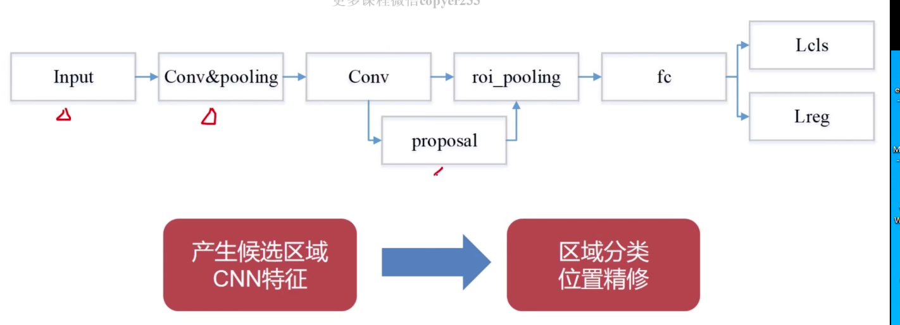
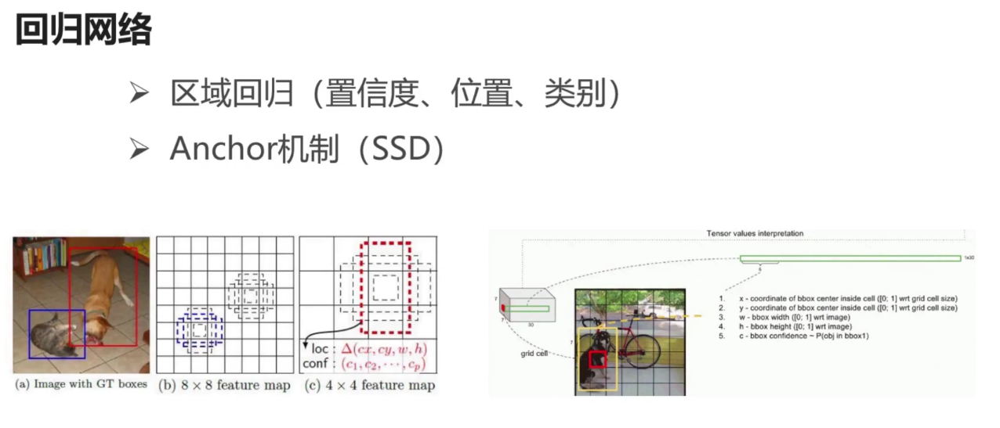

# 
深度学习目标检测算法原理实践精讲
##1、 课程介绍
###1-1 课程导学
>1、目标检测的应用场景
	
		1、人脸检测
		2、物体检测
		3、行人车辆检测
		4、文本检查

>2、目标检测常用算法
	

1. Faster RCNN 系列算法
	
	基本流程、RCNN/Faster RCNN 、Faster RCNN变种、主干网络设计思想RPN原理、OHEM、NMS、Soft-NMS、实验结果分析、不同算法优缺点、应用场景

2.SSD 算法

	基本流程 Default box Prior box 、样本构造、数据增强、损失函数、SSD变种、网络性能对比、实验结果分析、不同算法优缺点、应用场景

3.Yolo系列算法

	基本流程 、主干网络结构、设计思路、Yolov1/v2/9000/v3、Anchor Boxes 、Multi-Scale Training、 Darknet、不同算法的优缺点、网络性能你对比、实验结果分析
4.文本检测系列算法

	传统文本检测方法、物体检测VS文本检测、文本检测算法优化方法、常用算法模型、CTPN/EAST/textboxes、文本检测数据集介绍、不同数据集比较
5.多任务系列算法

	原理分析、网络结构、泛化性分析、学习机制、使用场景、脸部特征点检测：TCDCN、人脸识别：DeepID2、物体检测与分裂、旋转人脸网络、文本检测与识别、多任务网络训练技巧

>3、应用案例

	1、SSD人脸检测
	2、Yolov3通用物体检测
	3、Faster RCNN ADAS场景
	4、EAST 自然场景文本检测

>4、开发流程

>5、掌握YOLO系列算法、Faster RCNN系列算法啊、ＳＳＤ系列算法啊、文本检测线管的系列算法、多任务网络系列算法

##２目标检测算法基础介绍
###2-1 目标检测问题定义
>1、目标检测问题定义

	目标检测是在图片中对可变数量的目标进行查找和分类
	1、目标种类与数量问题
	2、目标尺度问题
	3、外在环境干扰问题

>2、目标检测VS图像分割

	置信度：查找目标的概率值。
>2、目标检测VS目标分割

	image classification（图像分类）
	Object localization（目标检测）
	Semantic segmentation(语义分割)
	instance segmentation（实力分割）
	note：目标检测主要定位目标的位置 采用上采样 反卷积
		目标分割：
----------
###2-2 目标检测问题方法
>1、  创痛目标检测方法到深度学习目标检测方法的变迁

	
	
	传统目标检测：是基于传统手动特征的检测算法和滑动窗口实现目标检测
	缺点：手动设计特征很难设计，设计特征存在各种问题，效率存在问题，滑动窗口分类判定，提取滑动窗口耗时，DPM后进入瓶颈

	overfeat 和RCNN只是利用卷积神经网进行特征的提取，并没有从本质改变策略，速度依然存在瓶颈，后来Faster RCNN 这样方法提出后通过RPN网络代替传统方法，性能和速度提升。YOLO进一步提升。
	基于一体化卷积网络和基于Object Proposal的检测
	
>2、算法基本流程

>3、传统目标检测方法

	Viola-Jones
	HOG+SVM
	DPM ....

>4、深度学习目标检测方法

	one-stage（YOLO和SSD系列）
	Two-stage（Faster RCNN系列）

>5、传统目标检测方法VS深度学习目标检测方法

传统目标检测方法|深度学习目标检测方法
--|:--:
手动设计特征|深度网络学习特征
滑动窗口|Proposal或者直接回归
传统分类器|深度网络
多步骤|端到端
准确度和实时性差|准确度高和实时性好
----------
###2-3传统目标检测方法基本流程
>1、基本流程

	低层次特征：基于纹理，形状、颜色等最基本特征
	中层次特征：基于底层特征进行机器学习的原理，进行特征学习，特征挖掘的过程得到的特征
	高层次特征：将低层次特征和中层次特征进一步提取和挖掘，例如语义特征。、

>note：深度学习一般是使用低层次和中层次特征

----------

###2-4常见传统目标检测算法-Viola-Jones

>1、Viola-Jones（ 人脸检测）

	Haar特征抽取（纹理特征的一种）
	训练人脸分类器（Adaboost算法等）
	滑动窗口

0 180 45 135度四个方向进行差值求解

>2、Adaboost算法

	

1. 初始化样本的权重w，样本权重之和为
2. 训练弱分类器
3. 更新样本权重
4. 循环第2步
5. 结合做个分类器结果，进行投票

>note：对于分类错误的样本，提高权重，正确的样本，降低权重。

###2-5常见传统目标检测算法-HOG+SVM
>1、HOG+SVM（行人检测、Opencv实现）

1. 提取HOG特征
2. 训练SVM分类器
3. 利用滑动窗口提取目标区域，进行分类判断
4. NMS
5. 输出检测我结果

>2、HOG特征

1. 灰度化+Gamma变换
2. 计算梯度map x, y x/y=tanx θ量化
3. 图像划分成小的cell，统计每个cell梯度直方图
4. 多个cell组成一个block，特征归一化
5. 多个block串联，并归一化

>3、HOG+SVM（行人检测、Opencv实现）

1. SVM		二分类建模  松弛变量 支持向量
2. 最大分类间隔面

###2-6常见传统目标检测算法-DPM
>1、DPM（物体检测）

	2008年Pedro Felzenszwalb提出
	VOC，07，08，09年的检测冠军
	2010 VOC授予“终身成就奖”
	HOG的扩展
	利用SVM训练得到物体的梯度

>2、DPM（物体检测）

	有符号梯度 0-360 18
	无符号梯度	0-180 9

>3、DPM（物体检测）

	计算DPM特征图
	计算响应图（root filter 和part filter）
	Latent SVM 分类器训练
	检测识别
###2-7 常见传统目标检测算法-Soft-NMS
>1、NMS（非极大值抑制算法）
>
	目的：消除多余的框，找到最佳的物体检测位置
	思想：选取哪些领域里分数最高的窗口，同时硬质哪些分数低的窗口
	Soft-NMS

>2、NMS（非极大值抑制算法）

	 相邻区域内的检测框的分数进行调整而非彻底抑制，从而提高了高检索率情况的准确率
	
	 在低检索率时仍能对物体检测性能有明显提升

###2-8 Two-Stage基本介绍，流程与常见算法
>1、基于Two-stage的目标检测算法综述

	Two-stage基本介绍
1. CNN卷积特征
2. R.Cirshick et al.,2014提出R-CNN到faster RCNN
3. 端到端的目标检测（RPN网络）
4. 准确度高、速度相对one-stage慢

>2、Two-stage基本流程

输入层---卷积层--RPN层--全连接层--1、分类2、回归 对候选取悦目标位置的判断和精修

>3、Two-Stage常见算法

	RCNN 
	Fast RCNN
	Faster RCNN
	Faster RCNN的变种

###2-9 Two-Stage核心组件

	CNN网络
	RPN网络
>1、CNN网络设计原则

1. 从简到繁再到简的卷积神经网
2. 多尺度特征融合的网络
3. 更轻量级的CNN网络

>2、RPN网络

1. 区域推荐（Anchor机制）
2. ROI pooling
3. 分类和回归

 
	
	n-- 当前处理样本数量
	c - channal个数
	w --长度
	h--宽度 

RPN网络区域推荐和候选目标的筛选
 
正样本包含候选区域的样本  >0.7 
负样本：不包含候选区域额的样本 < 0.3
IOU 真值和候选区域的覆盖面积 0.3-0.7不用
 

m*c*8*8 ROI 抠图和resize固定同样大小

>3、Two-Stage改进方向

1. 更好的网络特征
2. 更精准的RPN
3. 更完善的ROI分类
4. 样本后处理
5. 更大的mini-batch

###2-10 One-Stage基本介绍，流程与常见算法

>1、基于One-stage目标检测算法综述
1. 使用CNN卷积特征
2. 直接回归物体的类别概率和位置坐标值（无region proposal）
3. 准确度低、速度相对于Two-Stage快

 

>2、One-Stage常见算法

 
 

###2-11 One-Stage 核心组件

	CNN网络
	回归网络
>1、CNN网络设计原则
1. 从简到繁再到简的卷积神经网
2. 多尺度特征融合的网络
3. 更轻量级的CNN网络

 
 
 

